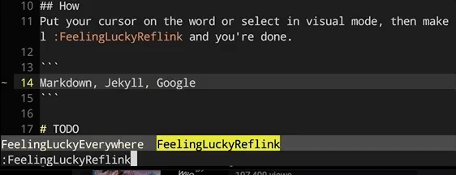

## Introduction
I feel I need a quick keyword linking tools in Vim so that I could keep writing while providing reflink. But I'm too lazy to grab link by myself and I trust Google most of the time. Therefore, this plugin is written to feed my need.

## Install
```
Plug 'daizeng1984/vim-feeling-lucky', {'do': 'pip2 install --upgrade google-api-python-client' }
```
As all Python remote plugins, after you `PlugInstall`, you need to run `:UpdateRemotePlugins`.

## How
Put your cursor on the word or select in visual mode, then make call `:FeelingLuckyReflink` and you're done.



# TODO
[ ] Grab link from Chrome's bookmark and put it to deoplete

